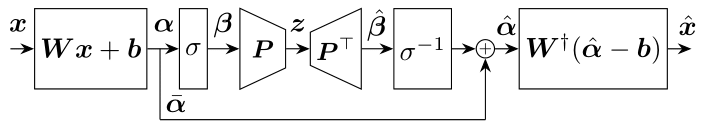

# invertible Kernel PCA (ikPCA)

Official implementation of the paper:\
**Invertible Kernel PCA with Random Fourier Features**, 2023, [[arXiv]](TODO). \
[Daniel Gedon](https://dgedon.github.io/),
[Antonio H. Ribeiro](https://antonior92.github.io/),
[Niklas Wahlström](http://www.it.uu.se/katalog/nikwa778),
[Thomas B. Schön](http://user.it.uu.se/~thosc112/).\



In the paper we propose a method which approximates the inverse of a kernel PCA (kPCA).
This is done by utilizing random Fourier features and exploiting the fact that the nonlinearity in those features
are invertible in a subdomain. We present results for denoising on three data sets: 
[s-curve](https://scikit-learn.org/stable/modules/generated/sklearn.datasets.make_s_curve.html), 
[USPS](https://scikit-learn.org/stable/auto_examples/applications/plot_digits_denoising.html#sphx-glr-auto-examples-applications-plot-digits-denoising-py) and
ECGs from the [CPSC dataset](http://2018.icbeb.org/Challenge.html). 


## Installation
The repository is tested with list of requirements in `requirements.txt`. To install the requirements, run the following command:
```
pip install -r requirements.txt
```

## Usage
The notebook `demo.ipynb` contains a demo of the methods by reconstructing noisy USPS data. We compare with PCA and kPCA.
This script can be used to reproduce Fig. 4 in the paper.

The python scripts `scurve_rff.py` can be used to reproduce Fig. 2 in the paper. 
The script `usps_regularization.py` can be used to reproduce Fig. 3 in the paper. 
The script `ecg_reconstruction.py` can be used to reproduce Fig. 5 in the paper.

Note that the ECG data is included in the folder `ecg_data/`. We pre-process the CPSC data as described in the paper.
For details on how to extract the single beats from the raw data, please contact the authors.


<!---
## Citation
If you use this code for your research, please cite our paper:
```
@article{TODO,
  title={TODO},
  author={TODO},
  journal={TODO},
  year={TODO}
}
```
-->